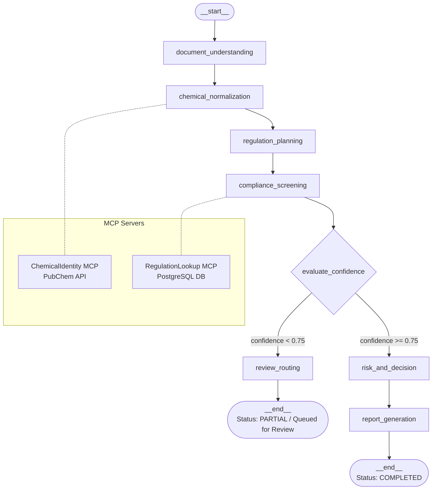

# Compliance Screening Multi-Agent System

## Overview
This is a robust, multi-agent compliance screening system designed to evaluate product Bills of Materials (BOMs), Safety Data Sheets (SDSs), and Full Material Declarations (FMDs) against international regulatory frameworks (e.g., RoHS, REACH SVHC). 

Built purely on a relational architecture, the system leverages a **LangGraph-driven orchestrator**, **FastMCP tools**, a **FastAPI backend**, and a **Streamlit frontend**. The pipeline automatically parses documents, normalizes chemical nomenclature, maps applicable regulations, generates screening judgments (with LLM-backed explainability), routes low-confidence evaluations to humans, and synthesizes executive compliance reports.

---

## Multi-Agent System

The core pipeline is orchestrated via **LangGraph**. The workflow utilizes specialized agents and tool nodes operating on a shared PostgreSQL database.

### LangGraph Nodes
1. **`document_understanding`**: Agent node. Parses raw uploaded files (PDF, CSV, XML, XLSX) to extract components, raw ingredient text, concentration values, and calculates per-document extraction confidence.
2. **`chemical_normalization`**: Tool node (Deterministic). Passes extracted raw chemical names to the Chemical Identity MCP server to normalize against authoritative CAS numbers and canonical names.
3. **`regulation_planning`**: Agent node. Determines applicable regulations based on product metadata (market country, product type, customer). Falls back to Gemini LLM for fuzzy classification if product types are ambiguous (e.g., classifying "smartwatch" as "electronics").
4. **`compliance_screening`**: Agent node. Queries the Regulation Lookup MCP server for specific threshold limits. Applies deterministic logic (`ALLOWED`, `THRESHOLD_EXCEEDED`, `EXEMPTION_AVAILABLE`) and batches results to the LLM to generate explainable reasoning strings.
5. **`review_routing`**: Human-in-the-loop (HITL) Router. Identifies any extraction or screening result with a confidence score `< 0.75`. 
6. **`risk_and_decision`**: Agent node. Aggregates all screening statuses into a final product-level decision (`PASS`, `FAIL`, `WARNING`, `REVIEW_REQUIRED`), calculates a 0.0–100.0 risk score, and generates a short rationale.
7. **`report_generation`**: Agent node. Synthesizes a comprehensive markdown executive report (Executive Summary, Violations, Risk Analysis) and writes it to disk.

### Supervisor & Routing Logic
The graph relies on a conditional edge `evaluate_confidence`. After the `compliance_screening` phase, the state is evaluated:
- **Low Confidence (Any score < 0.75):** Routes to `review_routing`. The workflow run is marked `PARTIAL`, low-confidence items are pushed into the `review_queue`, and automated execution halts (`__end__`), awaiting human resolution.
- **High Confidence (All scores ≥ 0.75):** Bypasses the human queue and routes directly to `risk_and_decision` for final scoring.

### Network Resilience (Retry Architecture)
To ensure high task success rates and stability against rate limits or temporary API timeouts, all LangGraph agent nodes that depend on external network requests (LLM generation or MCP external API calls) are wrapped in a **LangGraph `RetryPolicy`**. The graph automatically retries failed network nodes up to 3 times with an exponential backoff starting at 1.0 seconds.

---

## MCP Servers
The architecture strictly enforces separation of concerns by wrapping external APIs and database queries into FastMCP servers.

1. **`ChemicalIdentity`** (Directory: `mcp_servers/chemical_identity_mcp/`)
   - **Tool**: `resolve_ingredient`
   - **Role**: Normalizes messy chemical names/synonyms into precise CAS numbers and canonical titles.
   - **Integration**: Actively calls the external **NIH PubChem PUG REST API** with built-in retry logic and in-memory caching.
   
2. **`RegulationLookup`** (Directory: `mcp_servers/regulation_lookup_mcp/`)
   - **Tool**: `get_thresholds_for_ingredient`
   - **Role**: Fetches strict numerical thresholds and exemptions for a given CAS number + Regulation Code.
   - **Integration**: Executes read-only queries against the local **PostgreSQL** database (tables: `regulations`, `ingredients`, `regulation_thresholds`).

---

## Architecture Diagram



---

## Technology Stack

The project operates entirely on a local/bare-metal environment (No Docker containerization is required or provided).

- **LLM Engine**: Google Gemini (`gemini-3.1-flash-lite` via `langchain-google-genai` wrapper, running at `temperature=0.0` for deterministic outputs).
- **Agent Orchestration**: `langgraph`
- **Tool Servers**: `mcp` (FastMCP)
- **Database**: PostgreSQL (v16+) via the `asyncpg` async driver. (Note: Neo4j is *not* implemented or present in the execution path).
- **Backend Framework**: `fastapi` & `uvicorn`
- **Frontend Framework**: `streamlit` (>= 1.41.0)
- **Document Parsing**: `pymupdf` (PDF), `pandas` + `openpyxl` (CSV/Excel), `lxml` (XML)

---

## Evaluation Metrics

System performance is tracked via the Settings page (`frontend/pages/8_Settings.py`). The metrics dynamically calculate statistics based on the Postgres database, handling empty states gracefully:

1. **Task Success Rate**: Calculates the percentage of `COMPLETED` runs against all eligible runs (`COMPLETED`, `FAILED`, `PARTIAL`). 
   - *Empty State*: Displays a warning banner `"Insufficient or no eligible data in this time window"` and hides the metric cards if no runs exist.
2. **Reliability / Run Consistency**: Actively runs parallel evaluations on a separate `compliance_screening_test` DB to calculate Jaccard overlap consistency (Data & Decision consistency).
   - *Empty State*: Shows `"No reliability evaluations have been run yet."` banner until the user triggers a run.
3. **Graceful Failure Handling Rate**: Calculates the percentage of total failures that were safely caught by the human-in-the-loop node (`PARTIAL` status) vs absolute crashes (`FAILED` status).
   - *Empty State*: Shows `"Insufficient data / No non-recoverable failures in this time window."`
4. **Tool Call Success Rate**: Calculates success percentage of internal MCP and LLM tool calls by querying `tool_call_logs`.
   - *Empty State*: Metric cards safely render `"N/A"` to prevent division-by-zero errors.
5. **Recovery Rate**: Calculates the percentage of human-reviewed items in the `review_queue` that have been successfully mapped to `RESOLVED` vs the total number of items ever routed to the queue.
   - *Empty State*: Displays `"Insufficient data / No recoverable failures in this time window."`

---

## Quickstart Guide

The following steps assume you are running a bash-compatible terminal (Git Bash, Linux, or macOS).

### 1. Prerequisites
- Python 3.11+
- PostgreSQL 16+ running locally
- Google Gemini API Key

### 2. Environment Setup
```bash
cp .env.example .env
```
Edit `.env` and add your `GEMINI_API_KEY`. (Ensure `DATABASE_URL` matches your local Postgres credentials).

### 3. Database Initialization
Run the provided shell script to drop, recreate, schema-migrate, and seed the local database:
```bash
chmod +x database/reset_db.sh
./database/reset_db.sh
```

### 4. Launch Backend API
In Terminal 1:
```bash
cd backend
python -m venv .venv
source .venv/bin/activate  # (Windows: .\.venv\Scripts\Activate.ps1)
pip install -r requirements.txt
uvicorn backend.main:app --host 127.0.0.1 --port 8000 --reload
```

### 5. Launch Frontend UI
In Terminal 2:
```bash
cd frontend
python -m venv .venv
source .venv/bin/activate  # (Windows: .\.venv\Scripts\Activate.ps1)
pip install -r requirements.txt
streamlit run streamlit_app.py
```
Access the application at `http://localhost:8501`.

---

## Disclaimer
This software is a multi-agent assistance prototype designed to accelerate supply chain document review and flag potential regulatory threshold violations. **It is not a certified legal, regulatory, or metallurgical authority.** All automated compliance judgments (especially those involving exemptions, fuzzy product matching, or LLM-based reasoning) must be reviewed by qualified human compliance officers before being used in formal supply chain audits or customs declarations.
